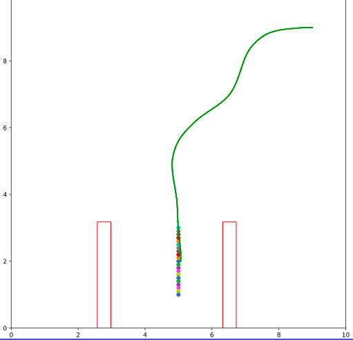

# RRT-Holonomic-Robots-4-Wheel
Path planning for Holonomic robots - 4 wheel using RRT Algorithm

## Kinematics for 4-wheel robot

## Outputs
### Start: 9, 9, 180; Goal: 5, 2, 270

### Start: 8, 2, 90; Goal: 1.5, 4, 90

